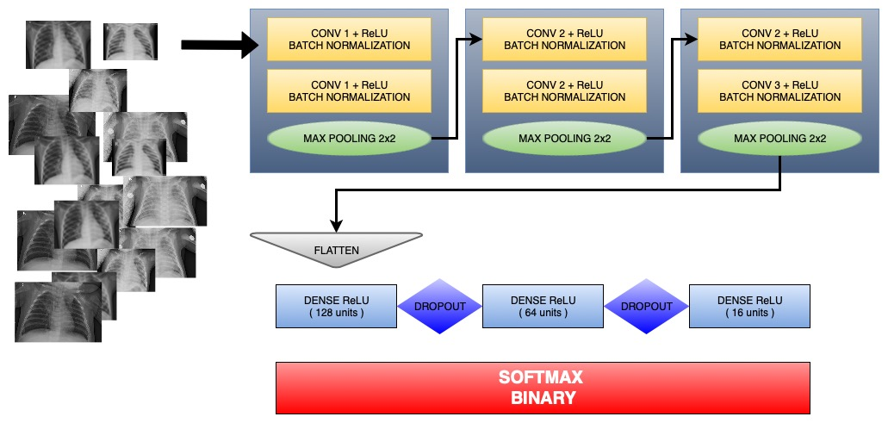
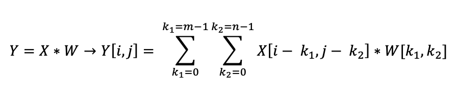
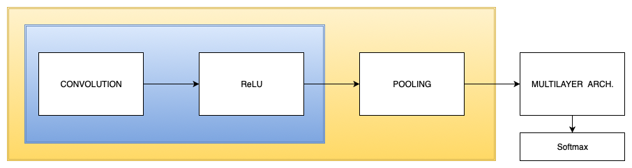
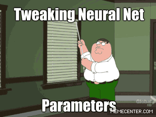
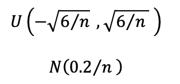

# Chest X-Ray Images (Pneumonia)

<h1>Convolutional Neural Network with Pyspark</h2>

<h2>Approach</h2>

<h3>Image preprocessing</h3>

<ul>
	<li>
		<b>Image resize to 128 x 128</b>
	</li>
	<li>
		<b>Z-scores normalization</b>
	</li>
</ul>

<h3>Network Architecture</h3>

	

<ul>
	<li>
		<b>Weights initialization</b>: Normalized initialization with mean 0 and variance dependent on the number of entries with normal distribution.
	</li>
	<li>
		<b>Biases initialization</b>: Random initialization with normal distribution, minimum value of 0.05 and maximum of 0.2.
	</li>
	<li>
		<b>Optimizer</b>:Adaptative momments, with learning rate 0.00005 .
	</li>
	<li>
		<b>Loss function</b>: Binary cross entropy.
	</li>
	<li>
		<b>Batch size</b>: 64
	</li>
	<li>
		<b>Validation split</b>: 20% from training set
	</li>
</ul>

<h2>Theoretical fundament</h2>

	Based on:
	<li>
		<i>Deep Learning, Ian Goodfellow, Yoshua Bengio, Aaron Courville (2017, MIT)</i>
	</li>
	<li>
		<i>Redes neuronales & deep learning, Fernando Berzal (2018)</i>
	</li>
	

<h3>Introduction</h3>

 
	Deep convolutional neural networks (Convolutional Neuronal Network) build what is called a <b>hierarchy of characteristics</b>. This hierarchy is based on the combination of low level characteristics (edges, spots, etc.) in different layer structures to form high level characteristics (shapes, objects, etc.).
	This type of architecture calculates a <b>map of characteristics</b> from local receptive fields of the image. Each feature map element is connected to a small region of the image. <b>Different feature maps share (partially) the same weights</b>. This implies a significant reduction in the number of network parameters. Additionally, this type of structure takes into account the <b>spatial</b> information of each of the pixels allowing to capture the most relevant characteristics of the image.
	CNNs are formed by a series of <b>convolutional layers</b>, <b>subsampling layers (commonly known as pooling layers)</b> and completely connected layers (essentially multilayer perceptrons). Of the different layers that make up the network, subsampling layers have no parameters to learn.

<h3>Convolutional layers</h3>

	The convolution is the main characteristic of the CNN, this is denoted as Y = X * W, where Y is the result vector of the convolution, X is the input vector or signal and W is the filter or kernel.
	The equation that defines the convolution operation is as follows:

	

	The limits of the input vector X are filled with <b>zero-padding</b> (although there are alternatives), the number of surrounding zeros is denoted by the index p. In the equation the filter has a total of m * n elements and the input vector has dimensions i, j. Taking into account the zero fill, the vector x has a size of (i + 2p), (j + 2p).
	In the filling with zeros discussed above, any p greater than or equal to zero can be used. In this context there are three filling strategies:

	<ol>
		<li>
			<b>Complete</b>: Filling with of i with p = m - 1 and j with p = n - 1 zeros. Complete filling increases the output dimensions, it is not usually used in practice. Output vector dimensions:	( i + 2( m - 1 ), j + 2( n - 1 ) )
		</li>
		<li>
			<b>Equal</b>: Fill in i and j with p = 1. In this case the output vector Y has the same dimensions as the input vector X.
		</li>
		<li>
			<b>Valid</b>: This type of filling implies a p = 0, that is, without filling.
		</li>
	</ol>

	The most used filling in CNNs is the <b>same</b>, it will be the one we will use in our network. One of its main advantages is that it maintains the dimensions of the original image of the input tensors. Therefore, with the convolutional layers we will maintain the size of the image by reducing it only with the subsampling or pooling layers.

	Another important factor to consider is the <b>displacement of the filter W with respect to the input vector</b>, this will have a direct impact on the size of the output layer.

<h3>Pooling layers</h3>

	This is an interesting element of CNN networks since it decreases the size of the characteristics analyzed by decreasing the computational cost and overfitting. There are several subsampling strategies, usually max-pooling and mean-pooling (average-pooling) are applied. In this type of layers it is necessary to define the size of the grouping (dimensions of the region to be reduced) and the displacement.

	Max-pooling assigns the maximum value of the grouping layer to the pixel value of the output layer. On the other hand, mean-pooling calculates the average value.
	One of the characteristics of max-pooling is local invariance, that is, small changes in a region of the grouping region do not affect the result of max-pooling. This allows to generate characteristics less sensitive to noise in the data.

	In general it is common use max-pooling filters of 2x2 that are applied on adjacent regions of the entrance without overlapping.

<h3>Network archhitecture</h3>

	The architecture of a convolutive network usually combines convolutive layers with pooling layers. Sometimes a layer of ReLU units is included between the convolutive layer and the pooling layer that performs a non-linear transformation of its element-to-element input.In the implementation this layer has been included

	In general, the following scheme is usually used:

	

	It is usual to concatenate two convolutive layers before each poooling layer, in order to extract more complex characteristics of the input before performing the destructive pooling operation.In addition it is preferable to use several convolutive layers with small filters to a single large filter.

	In order to minimize the impact on memory and computational costs, it is convenient to start from relatively simple topologies and increase their complexity based on the results. When the network training does not converge we are likely to have to add more hidden nodes. The network size should be extended in terms of depth rather than width. This is because a network with multiple hidden layers is able to implement functions of greater complexity and therefore solve more complex problems.

	Empirically it has been shown that the deeper the network the better it usually generalizes. However its training is more complicated, this is because different layers learn at different speeds and the gradient used to adjust the weights will be lower in the layers farther from the output, something called <b>vanishing gradient</b>. A common strategy is to start from a simple model and add layers until the error in the validation set is reduced.
	An alternative commonly used to solve the gradient problem is to use <b>batch normalization</b>, that  normalize the data of each minilot before moving on to the next layer.
	Another aspect is the use of different activation functions, it has been seen that the use of sigmoidal neurons usually saturates the learning process too much by slowing it down.

<h3>What about <b>transfering learning</b></h3>

	This consists in using a network previously trained in solving <b>generic problems</b> and then using it in solving more specialized problems. However, the available networks have been trained to classify objects that are not found in the medical field as x-ray images. Therefore <b>in this case it does not make much sense to use transfering learning since we are using networks trained with objects totally different from our images</b>. In fact, most of the networks available in keras are trained with ImageNet examples, unrelated to our problem.

<h3>Activation function</h3>

	There is a wide variety of activation functions, in this case it was decided to use Rectified Linear Units (ReLU). Non-symmetric sigmoidal neurons with respect to origin tend to saturate too early during training, this substantially slows learning. It is common to use activation functions whose derivative is not defined at some points, for example the rectified linear units (ReLU). These are limited to making a linear combination of their weights and inputs generating a non-linear output. Additionally, the evaluation of this function is much more efficient and the training of the neural networks that use it is faster. The problem with networks that use this activation function is that they are unable to learn when their activation is null since their activation function is flat in this area. For this reason it is convenient to <b>initialize the biases of the neuron with a small positive value</b> to try to get the neurons to activate during the initial stages of network training.

<h3>Data preprocessing</h3>

	The normalization of the input data is usually done using <b>z-scores</b> (subtract the mean and divide by the standard deviation).
	On the other hand, a simple way to expand the training set in order to improve network performance is to <b>add artificially created examples</b>. Additionally, this approach gives the network <b>invariance against usual changes in data entries</b>.

<h3>Training performance</h3>

	During the training process, two key points must be taken into account:

	<ol>
		<li>
			If the network performance on the training set is not good, it indicates that the training algorithm is not taking advantage of the data, so we must <b>increase its complexity</b>, for example by introducing hidden layers. Likewise, we may be using a too elementary <b>learning rate</b> that prevents their convergence, so a possible solution is to change it. Finally, if correcting the previous two points the performance does not improve, it may be that the quality of the training data is not good enough.
		</li>
		<li>
			If the pnetwork performance is much worse in the test set than in the training set it is usually necessary to <b>expand the training set</b>. Another alternative is to use <b>regularization strategies</b> to prevent overfitting, or reduce the complexity of the network.
		</li>
	</ol>

	

	An interesting regularization strategy is the <b>dropout</b>. This strategy consists of each iteration randomly eliminating a fraction of the neurons located in the hidden layers with a certain probability. We will use the commonly used probability of 0.5.

	The aforementioned regularization strategy works so well because by eliminating a significant percentage of neurons, the network is forced to learn a more redundant representation of the data. In this way, more general and robust data patterns are learned. Keep in mind that the dropout is only carried out during the training phase. TensorFlow automatically implements an escalation strategy to compensate the weights of the eliminated neurons. This is important because if for example we eliminate 50% of neurons, we must reduce the activation of active neurons to 50%.

<h3>Weight and biases initialization</h3>

	It is recommended that the weights be initialized with small values, close to zero and both positive and negative. This facilitates that given an error signal some weights are updated in one direction and others in the opposite direction. However, it may happen that with this initialization the weights end up being null. <b>That should be avoided especially when using ReLU units</b>. If the weights are too high they can generate problems associated with saturation of the network neurons or chaotic behavior of the algorithm. On the other hand, if these weights are too low, it will happen that many of the neurons end up becoming redundant.

	There are different initialization strategies, in the end everything consists of testing and contrasting results. However, when using ReLU units, researchers at <b>Microsoft Research</b> suggest that the variance in the initialization of the weights be doubled. Normally the networks that use ReLU units initialize their weights following these two equations:

	

	On the other hand, in the biases initialization we are interested in preventing ReLU units from becoming overly saturated during. During initialization they are usually assigned a small positive bias. This allows the units to remain active initially for most of the training data.

<h3>Learning rate</h3>

	If the learning rate is too small, the convergence of the network may be unnecessarily slow as the weights change very poorly. On the other hand, when it is too high it can trigger oscillations resulting in unstable behavior. When it is observed that the error oscillates the learning rate is reduced, on the other hand if the algorithm learns too slowly it is usually increased.
	A commonly followed strategy is that the learning rate is initially high and subsequently decreases.

<h3>Moments</h3>

	The use of moments is equivalent to including a certain "inertia" in the learning of the network. This helps the descending gradient does not get stuck in local minimums. Keep in mind that the use of moments with a value that is too high may cause the algorithm to oscillate, while the use of moments that are too low will get stuck in local minimums. 

	Another alternative is to gradually decrease the learning rate used gradually. In this context keras provides many optimizers. In the example shown <b>Adam</b> has been used. This algorithm uses adatative moments.

<ul>
	<li>
		<b>AdaGrad</b>: Individual adjustment of the learning rates for each parameter of the network making the adjustment inversely proportional to the square root of the sum of the historical values of the squared gradient. Its main drawback is that <b>learning rates decrease too early.</b>
	</li>
	<li>
		<b>AdaDelta</b>: This is an improvement of AdaGrad that instead of accumulating all historical gradients is limited to the last N values. It is generally observed that this optimizer converges faster than AdaGrad and achieves better solutions.
	</li>
	<li>
		<b>RMSprop</b>: This algorithm only uses the gradient sign to modify the weights and the magnitude of update is calculated dynamically. This usually works quite well when combined with moments like Nesterov.
	</li>
	<li>
		<b>vSGD</b>: Automatically adjusts the learning rates trying to optimize the expected value of the error function.
	</li>
	<li>
		Other commonly used optimizers are <b>AdaSecant</b>, Adam variants such as <b>AdaMax</b> and <b>NAdam</b> or <b>Rprop</b> and their derivatives, ...
	</li>

</ul>

	

